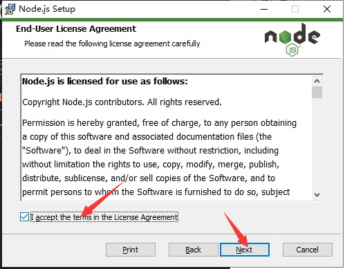
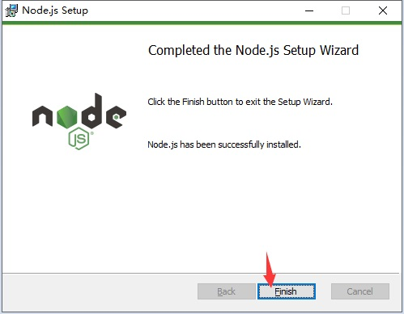

# 前端基础

## 软件安装和配置

- 检查软件安装版本
  - 执行`node -v`检查 node.js 是否安装成功 当前项目使用 V10 版本
  - 执行`cnpm -v`检查 cnpm 是否安装成功(需要 node 安装成功之后)
  - 执行`gulp -v`检查 gulp 是否安装成功(需要 node 安装成功之后) 当前项目使用 v3.9.1 版本
- 安装软件
  - [node.js 官方网站](http://node.org/)
  - [node.js 淘宝源官方网站](http://npm.taobao.org/)
    - [node.js v10 下载地址](http://nodejs.org/dist/v10.13.0/node-v10.13.0-x64.msi)
    - 安装图示
    - 
    - 
    - 
    - 
    - 
    - 
    - 
    - 
  - 执行`npm config set registry http://registry.npm.taobao.org`设置淘宝源
  - 执行`npm -g install cnpm`安装 cnpm
- [gulp 官方网站](http://gulpjs.com)
  - 执行`cnpm -g install gulp`全局安装 gulp 客户端

## 项目配置和初始化

- 执行`cnpm init`初始化项目 npm
  - 1:package name(目录名称) 输入项目名称回车默认就是目录名称
  - 2:version(1.0.0) 输入项目版本号
  - 3:description 输入项目描述
  - 4:entry point(index.js) 入门 js
  - 5:test command 测试命令
  - 6:git repository git 的地址
  - 7:keywords 关键字
  - 8:author 作者
  - 9:license:(ISC) 版本协议
  - 10:Is This OK？(yes) 确认完成
  - 执行完成项目里面会出现 package.json 可以直接修改该文件
- 安装 jquery 和 bootstrap3
  - 执行`cnpm --save install jquery`安装 jquery
  - 安装成功 `package.json`中`dependencies`小节中会出现 jquery 版本号 项目`node——modules`目录中也会出现 jquery
  - 执行`cnpm --save install bootstrap3`安装 bootstrap3
  - 安装成功 `package.json`中`dependencies`小节中会出现 bootstrap3 版本号 项目`node——modules`目录中也会出现 bootstrap3
  - 执行`cnpm --save install jq-easyui`安装jquery-easyui依赖
  - 安装成功`package.json`中`dependencies`小节中会出现jquery-easyui版本号 项目`node——modules`目录中也会出现 jquery-easyui
- 配置 js 目录

  - 在项目根目录创建[jsconfig.json](jsconfig.json)文件
  - `exclude` 小节是配置忽略的文件或者目录的列表 一定要`node_modlues`目录排除 该目录是 nodejs 插件目录 也不要将该目录添加到 git 中
  - `typeAcquisition`小节是配置要 js 提示的 api 列表

- vscode 插件安装
  - Bracket Pair Colorizer (彩色括号配对)
  - Chinese (Simplified) Language Pack for Visual Studio Code (中文简体)
  - HTML CSS Support (html 文件中 css 名称支持插件)
  - Markdown All in One (md 文件预览插件)
  - markdownlint (markdown 文件语法拼写检查)
  - nginx-formatter (nginx 格式化插件)
  - nginx.conf (nginx 配置文件插件)
  - open in browser (在浏览器中打开文件)
  - Prettier - Code formatter (代码格式化插件)
  - VSCode Great Icons (vscode 图标美化 在文件图标主题中使用)
- 安装前端相关开发nodejs插件
  - 执行`cnpm --save install gulp` 安装项目 gulp依赖
  - 执行`cnpm --save install del` 安装项目del(文件删除插件)依赖
  - 执行`cnpm --save install gulp-file-sync` 安装gulp-file-sync(文件同步插件)依赖
  - 执行`cnpm --save install gulp-watch` 安装gulp-watch(文件变化检测插件)依赖
  - 执行`cnpm --save install gulp-concat` 安装gulp-concat(文件合并插件)依赖
  - 执行`cnpm --save install jshint gulp-jshint` 安装gulp-jshint(js语法插件)依赖
  - 执行`cnpm --save install gulp-uglify` 安装gulp-uglify(js混淆插件)依赖
  - 执行`cnpm --save install gulp-plumber` 安装gulp-plumber(gulp错误冒泡插件)依赖
  - 执行`cnpm --save install gulp-clean-css` 安装gulp-clean-css(css压缩插件)依赖
  - 执行`cnpm --save install gulp-sourcemaps` 安装gulp-sourcemaps(map文件插件)依赖
- 项目初始化
  - 创建[gulpfile.js](gulpfile.js)(gulp任务配置)文件
  - 第三方依赖文件复制
- 项目开发脚本
  - 执行`StartDev.bat`启动开发者模式(开启Nginx 打开浏览器 开启项目Dev)
  - `gulp dev`的窗口通过按键`Ctrl+C`后输入`y`中断执行
  - `browser.bat`的窗口可以直接关闭
  - `StartNginx.bat`需要通过执行`StopNginx.bat`来中断执行后关闭
  - 如果`gulp dev`意外中断只要单独执行`StartWacth.bat`重新开启
  - 如果`StartNginx.bat`意外中断还是需要执行`StopNginx.bat`确认中断后再执行`StartNginx.bat`重新开启
  - 如果浏览器关闭需要执行`StartBrowser.bat`重新开启
- 项目clone下来后的初始化步骤
  - 确保[软件安装和配置](#软件安装和配置)的步骤已经执行
  - 修改`browser.bat`中的浏览器位置为正确的本机配置
  - 修改`StartNginx.bat`和`StopNginx.bat`中的Nginx的位置为正确的本机位置
  - 执行`cnpm install`初始化插件和依赖
  - 执行`gulp build`指令初始化项目后即可进入`项目开发脚本`的步骤启动开发模式